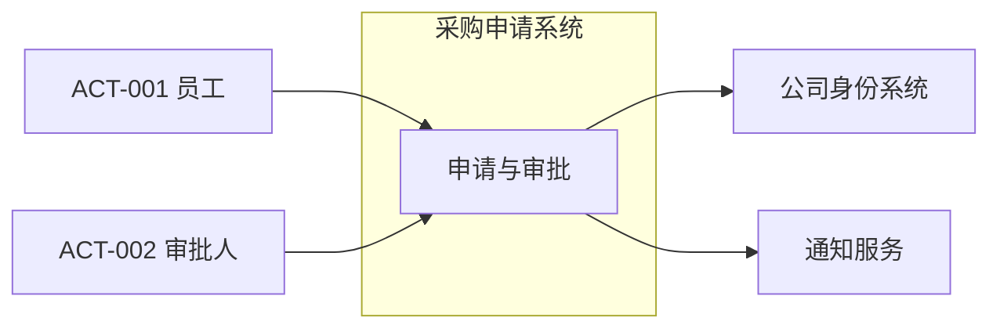

# 使用示例

仅在用户需要理解交付形式或交互方式时读取本文件。示例中的内容不是任何真实项目的默认答案。

## 示例一：启动新设计

用户：

> 我们要做一个内部采购申请系统，请帮我从需求开始设计。

合适的第一轮响应：

> 当前阶段是 00 项目概览。本轮先确定目标、主要用户和首期边界：
>
> 1. 当前采购流程中最需要解决的问题是什么？
> 2. 谁提交申请，谁审批，谁负责最终采购？
> 3. 首期需要覆盖申请、审批、下单中的哪些环节？
> 4. 是否需要连接现有账号、财务或供应商系统？
> 5. 哪个结果可以证明首期有效？

不合适的响应：

- 一次提出几十个问题；
- 未确认范围便选择微服务、数据库和消息队列；
- 直接生成完整设计并把推断标记为已确认。

## 示例二：用户不确定非功能目标

用户：

> 不知道并发量，大概公司内部几百人用。

合适的处理：

```markdown
## NFR-001 交互性能

- 状态：假设
- 适用范围：普通查询与提交操作
- 当前假设：正常工作时段内，95% 交互在 2 秒内完成
- 容量假设：注册用户不超过 1000，同时在线人数待确认
- 验证方式：上线前使用代表性数据进行负载测试
- 开放问题：OQ-003 峰值并发和批量操作规模
```

模型应说明该假设可能影响容量与部署设计，但不因精确并发未知而停止所有需求工作。

## 示例三：项目概览片段

```markdown
# 项目概览

> 状态：待确认

## 项目目标

缩短内部采购申请从提交到审批完成的时间，并让申请人能够查看当前处理状态。

## 当前范围

- 员工提交采购申请；
- 按金额和部门执行审批；
- 审批人同意或拒绝；
- 申请人查询状态并接收结果通知。

## 不在范围

- 供应商选择；
- 实际下单与付款；
- 财务记账。

## 假设

- 首期使用公司现有身份系统。

## 开放问题

- OQ-001：审批规则由部门还是财务统一维护？
```

对应上下文图：



## 示例四：用例到设计的追踪

```markdown
## FR-001 提交采购申请

- 用例：UC-001 提交采购申请
- 领域：DOM-001 采购申请
- 架构：CMP-001 采购申请服务
- 接口：INT-001 提交申请 API
- 详细交互：SEQ-001 提交申请
- 验证方式：用例验收测试与 API 集成测试
- 状态：完整
```

追踪关系应解释设计为什么存在，而不是要求每个简单条目都链接到所有层次。

## 示例五：需求变化后的回退

原设计：

> 所有采购申请只需直属主管审批。

新事实：

> 超过 5 万元还需要财务审批。

合适的处理：

1. 修订或新增对应 `BR-*` 和 `FR-*`。
2. 将 02～06 阶段标记为“需修订”。
3. 更新审批用例的备选路径。
4. 更新采购申请状态模型和审批规则。
5. 检查组件是否支持多级审批及规则配置。
6. 更新关键时序、数据结构和追踪关系。
7. 只重新确认受影响内容，不推翻无关设计。

## 示例六：避免过度设计

对于只有一个组件内部的普通列表查询，可以记录：

```markdown
## UC-006 查询本人申请

- 参与者：ACT-001 员工
- 结果：返回当前用户可见的申请摘要
- 关联：FR-006
- 设计说明：沿用 CMP-001 的查询接口，无独立时序图
```

不需要为它额外创建领域状态图、组件图、ADR 和多层类图。
