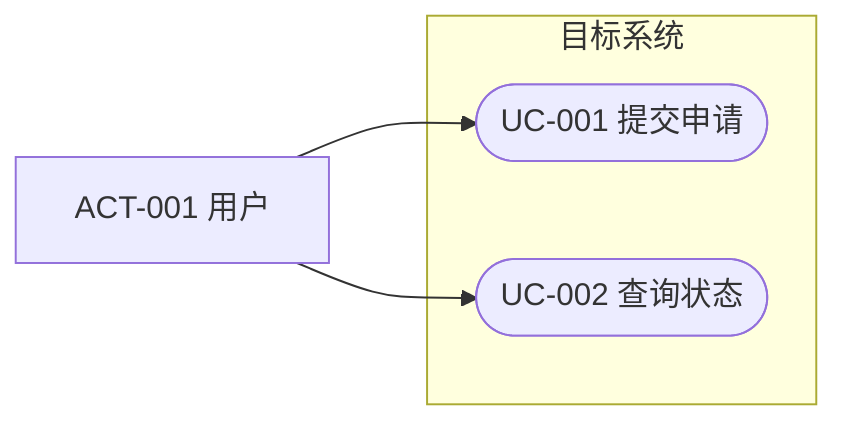
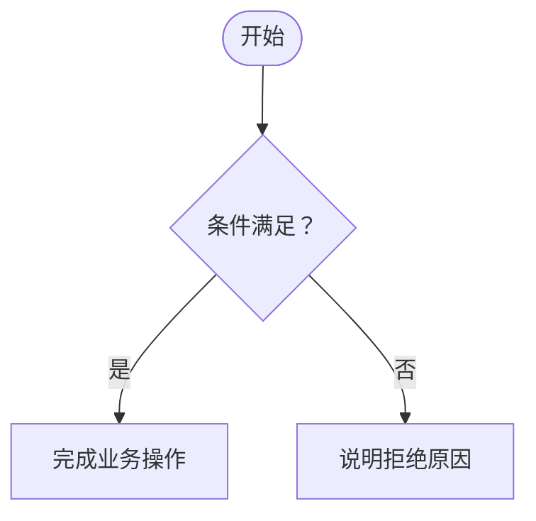

# 阶段 02：用例

## 阶段目标

从参与者目标出发，把功能需求组织成可讨论的业务场景，明确系统责任、正常流程、例外和完成结果。

用例描述外部可观察行为，不写控制器、服务类、数据库调用或页面组件。

## 进入阶段前

确认或读取：

- 系统边界和参与者候选；
- 已确认或可用于探索的功能需求与业务规则；
- 需求优先级和首期范围；
- 与权限、异常和外部系统有关的开放问题。

需求仍在变化时，可以形成用例草稿，但必须保留需求关联和假设。

## 参与者识别

参与者表示与系统交互的角色或外部系统：

- 主要参与者：主动使用系统实现业务目标。
- 支持参与者：提供数据、认证、支付、通知等能力。
- 运维或监管参与者：配置、审计、监控或处理异常。

避免：

- 用具体姓名代替角色；
- 把数据库、内部模块或线程写成外部参与者；
- 仅按职位名称区分实际权限和目标完全相同的角色。

参与者条目结构见 [templates/02-use-cases/actors.md](templates/02-use-cases/actors.md)。

## 访谈顺序

### 参与者目标

- 每类参与者希望通过系统完成什么结果？
- 什么事件触发该目标？
- 成功后，参与者或业务世界发生什么变化？
- 是否有其他角色审批、协助或接收结果？

### 主流程

- 从触发到完成，参与者与系统依次做什么？
- 每一步系统需要校验、计算或记录什么？
- 哪些业务规则影响流程？
- 哪一步产生不可逆或对外可见的结果？

### 备选与异常

- 输入缺失、无效、重复或冲突时怎么办？
- 权限不足或业务条件不满足时怎么办？
- 外部系统超时、拒绝或返回不一致数据时怎么办？
- 用户中途取消、重复提交或稍后继续时怎么办？
- 失败后业务状态是保持、回滚还是等待补偿？

### 批量与自动场景

- 是否有定时、消息或外部事件触发的无界面场景？
- 是否有批量处理、导入导出或后台对账？
- 自动流程失败时由谁发现和处理？

## 用例目录

`catalog.md` 使用 [templates/02-use-cases/catalog.md](templates/02-use-cases/catalog.md)，包含目录条目结构和可选的用例图骨架。

只有复杂或高风险用例才需要独立详细规约。简单查询可以保留在目录中。

## 详细用例规约

使用 [templates/02-use-cases/cases/uc-xxx-short-name.md](templates/02-use-cases/cases/uc-xxx-short-name.md)，复制后按 `uc-编号-短名.md` 重命名。

## 简化用例图

Mermaid 没有完整 UML 用例图，使用 flowchart 近似表达：

约定：

- 人或外部系统放在系统边界之外；
- 用例使用圆角或体育场形节点；
- 箭头仅表示参与关系，除非明确标注其他语义；
- `include`、`extend` 只有确有复用或可选扩展意义时才标注；
- 图只做目录导航，行为细节以用例规约为准。

## 流程图

当一个用例包含多个决策或参与方时，可以增加 flowchart：

不要同时用流程图和用例规约重复维护每个普通步骤。图只保留影响理解的分支和状态。

## 产物

按需创建：

- `docs/design/02-use-cases/README.md`
- `docs/design/02-use-cases/actors.md`
- `docs/design/02-use-cases/catalog.md`
- `docs/design/02-use-cases/cases/uc-xxx-short-name.md`

阶段 `README.md`（模板：[templates/02-use-cases/README.md](templates/02-use-cases/README.md)）汇总首期参与者、关键用例、覆盖情况和阻塞问题。

## 阶段完成判断

准备进入门禁前确认：

- 首期功能需求均有用例或其他明确承载方式；
- 每个关键用例表达参与者目标和完成结果；
- 主流程、重要备选流程和失败后的业务状态清楚；
- 权限与外部系统责任没有混淆；
- 关键业务规则和非功能需求已关联；
- 需要进入领域建模的问题已经暴露。

完成后执行用例门禁，再请求用户确认。
