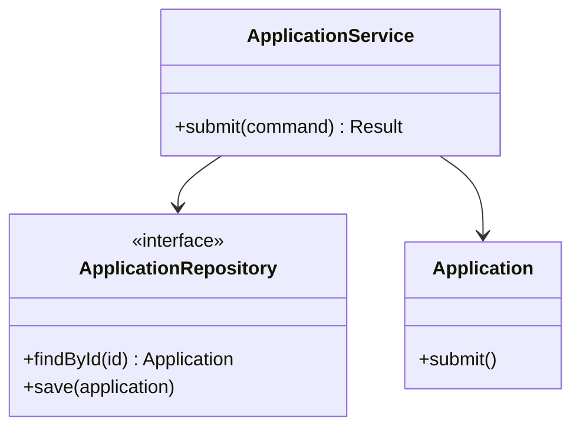

# 阶段 05：详细设计

## 阶段目标

把已确认架构转化为开发者可以实现的关键模块、接口、数据和交互设计。

详细设计按风险分配精力：

- 优先设计跨组件、高并发、高安全风险和业务规则复杂的路径；
- 简单 CRUD、框架样板和可由代码自然表达的局部细节不提前文档化；
- 文档解释约束、协作和取舍，不尝试成为代码的逐行镜像。

## 进入阶段前

确认或读取：

- 已确认的关键用例和异常流程；
- 领域模型、状态模型和业务不变量；
- 架构组件、接口、部署与 ADR；
- 需要详细设计的风险清单；
- 已存在代码、接口规范或数据库结构。

架构仍存在阻塞性边界问题时，不进入详细设计基线。

## 设计范围选择

对候选内容按以下因素排序：

- 业务失败成本；
- 技术不确定性；
- 跨边界数量；
- 并发、一致性或安全复杂度；
- 外部依赖不可靠程度；
- 多团队协作需要；
- 后期变更成本。

在阶段 `README.md` 明确哪些路径需要详细设计，哪些留给实现。

## 访谈顺序

### 模块内部责任

- 组件内部需要哪些职责单元？
- 哪个对象或服务负责执行关键业务规则？
- 哪些依赖需要通过接口隔离？
- 哪些信息必须在一个事务或操作边界内处理？

### 交互

- 从入口到结果，消息按什么顺序流动？
- 哪一步验证权限、业务规则和幂等性？
- 外部调用超时、拒绝或返回未知结果时怎么办？
- 重试是否会产生重复副作用？
- 哪些事件在事务提交前后发布？

### 数据

- 每个关键记录如何识别和关联？
- 哪些约束由数据库、领域逻辑或异步校验保证？
- 如何处理并发更新、版本冲突和历史记录？
- 数据迁移、回填、归档和删除是否影响设计？

### 接口契约

- 调用方必须提供什么，哪些字段可选？
- 成功和失败分别返回什么语义？
- 权限、限流、幂等和版本兼容如何处理？
- 日志和错误是否可能泄露敏感信息？

### 可观测性与测试点

- 哪些关键步骤需要日志、指标或追踪？
- 哪些不变量适合单元测试、契约测试或集成测试？
- 哪些失败必须支持人工诊断和恢复？

## 模块设计

按模块创建 `modules/短名.md`：复制 [templates/05-detailed-design/modules/short-name.md](templates/05-detailed-design/modules/short-name.md) 后按模块短名重命名。

## 设计类图

只有类和接口关系影响理解或协作时使用 classDiagram：

约定：

- 区分领域对象、应用服务和基础设施接口；
- 只展示稳定职责和重要签名；
- 不列 getter、setter 或框架生成成员；
- 不把尚未实现的每个文件都画成类；
- 领域类图和设计类图使用不同标题，避免混淆。

## 交互设计

高风险路径按 `interactions/seq-编号-短名.md` 拆分：复制 [templates/05-detailed-design/interactions/seq-xxx-short-name.md](templates/05-detailed-design/interactions/seq-xxx-short-name.md) 后重命名，模板包含 sequenceDiagram 骨架。

按需使用 `alt`、`opt`、`loop` 和注释表达关键分支。普通参数和内部函数调用不必全部展示。

## 数据设计

`data-model.md` 使用 [templates/05-detailed-design/data-model.md](templates/05-detailed-design/data-model.md)，覆盖逻辑模型、标识与约束、删除策略、状态与审计字段、索引假设、事务边界和迁移保留。

关系型结构可用 erDiagram。领域关系不应仅凭 ER 图推断。

## API 与消息契约

`api-contracts.md` 使用 [templates/05-detailed-design/api-contracts.md](templates/05-detailed-design/api-contracts.md)，按接口说明版本、字段语义、身份权限、验证、错误码、幂等语义、兼容策略和示例。

如果 OpenAPI、AsyncAPI、Protocol Buffers 或代码定义已经是权威契约，Markdown 只解释关键语义并链接权威文件，不重复维护完整字段表。

## 产物

按需创建：

- `docs/design/05-detailed-design/README.md`
- `docs/design/05-detailed-design/modules/short-name.md`
- `docs/design/05-detailed-design/interactions/seq-xxx-short-name.md`
- `docs/design/05-detailed-design/data-model.md`
- `docs/design/05-detailed-design/api-contracts.md`

阶段 `README.md` 使用 [templates/05-detailed-design/README.md](templates/05-detailed-design/README.md)，必须明确哪些路径需要详细设计、哪些留给实现。

## 阶段完成判断

准备进入门禁前确认：

- 所有高风险路径都有足够的可实现说明；
- 模块和接口没有突破架构边界；
- 关键错误、超时、重试、并发和一致性行为已说明；
- 数据设计能够维护领域不变量；
- 权限和敏感数据处理位置明确；
- 开发者可以据此拆分实现与测试任务；
- 普通实现细节没有被过度设计。

完成后执行详细设计门禁，再请求用户确认。
