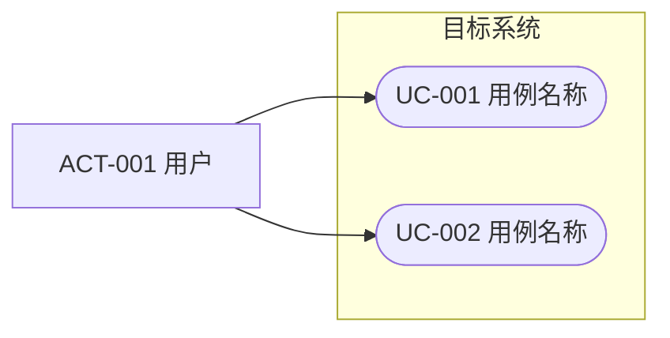

<!-- 用例目录模板。每个用例一个小节；简单查询可只保留目录条目，不建独立详细规约。 -->

# 用例目录

> 状态：草稿

## UC-001 用例名称

- 状态：草稿
- 主要参与者：ACT-001
- 目标：参与者希望获得的业务结果
- 触发：
- 优先级：必须 / 应该 / 可以 / 暂不
- 关联需求：FR-001
- 详细规约：[查看](cases/uc-xxx-short-name.md) / 无需独立规约

## 用例图（可选）

<!-- 图只做目录导航，行为细节以用例规约为准；include/extend 只在确有复用或扩展意义时标注 -->

