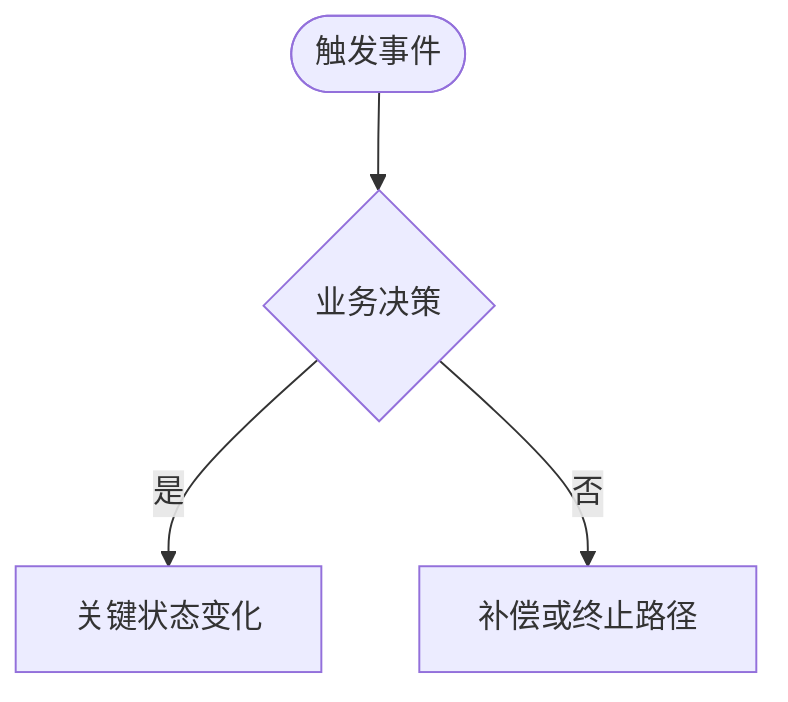

<!-- 业务过程模板。只绘制跨多个对象或角色的过程，不把每个用例重复成过程图。 -->

# 业务过程

> 状态：草稿
> 关联：UC-*、DOM-*

## 过程名称

### 触发与参与方

<!-- 触发事件、参与角色、人工与系统的责任分界 -->

### 流程图

```mermaid
flowchart TD
    start([触发事件]) --> decision{业务决策}
    decision -->|是| done[关键状态变化]
    decision -->|否| comp[补偿或终止路径]
```

### 关键说明

<!-- 业务决策依据、关键状态变化、不可逆节点、补偿或终止路径 -->
