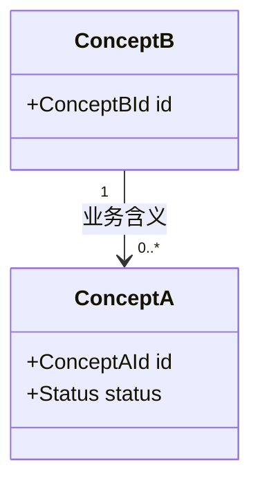

<!-- 领域模型模板：概念总览类图 + 概念条目 + 不变量说明。表达业务概念，不是数据库表、ORM 实体或框架类。 -->

# 领域模型

> 状态：草稿
> 关联：UC-*、BR-*

## 概念总览

<!-- 使用业务名称和单数形式；关系标签写业务含义；基数无法确认时标记待确认，不猜测 -->

## 概念条目

### DOM-001 概念名称

- 定义：使用业务语言给出准确含义
- 身份：如何判断是否为同一个对象
- 关键属性：只列有业务意义的属性
- 生命周期：
- 负责规则：BR-001
- 关系：
- 来源：UC-001
- 假设与开放问题：

## 不变量与所有权说明

<!-- 图无法完整表达的不变量、所有权边界和时间规则 -->
