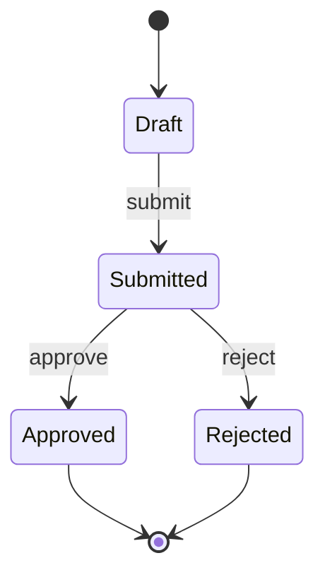

<!-- 状态模型模板。只对复杂生命周期建模；每张状态图必须伴随转换规则说明。 -->

# 状态模型

> 状态：草稿
> 关联：DOM-*、BR-*

## DOM-001 概念名称的状态生命周期

### 状态图

### 转换规则

| 转换 | 业务条件 | 执行角色 | 事件或副作用 | 并发与非法转换处理 |
| --- | --- | --- | --- | --- |
| Draft → Submitted | | | | |

<!-- 并发命令、重复命令和被禁止转换的处理方式必须逐条说明 -->
