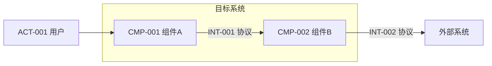

<!-- 组件清单模板。组件名体现业务或技术责任，禁用 Common、Utils 等无法判断边界的名称。 -->

# 组件与总览

> 状态：草稿
> 关联：UC-*、NFR-*

## 架构总览图

<!-- 图后说明：每个组件的责任、数据所有权、接口协议和方向、信任边界和故障边界、图中省略的内容 -->

## 组件条目

### CMP-001 组件名称

- 状态：候选 / 已确认
- 责任：
- 不负责：
- 拥有的数据：
- 提供接口：INT-001
- 依赖：
- 承载用例：UC-001
- 响应的质量属性：NFR-001
- 失败影响：
- 部署单元：
