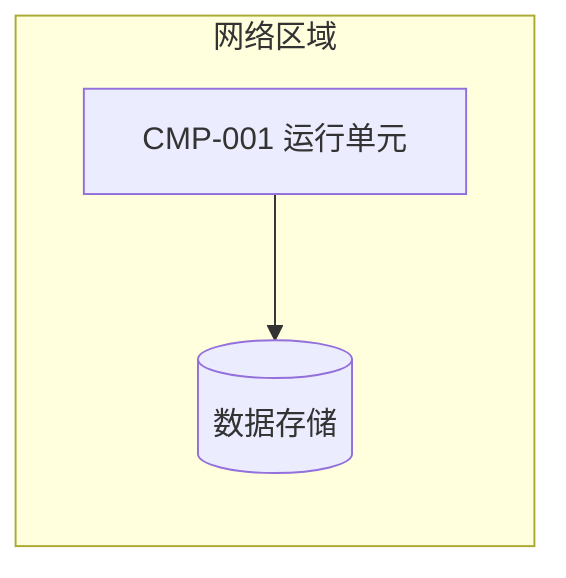

<!-- 部署视图模板。只表达影响设计的部署要素，不绘制云厂商全部资源。 -->

# 部署

> 状态：草稿
> 关联：CMP-*、NFR-*

## 部署图（可选）

## 运行单元

<!-- 单元清单、数量假设、需要独立扩缩容或故障隔离的单元 -->

## 网络区域与信任边界

## 数据存储与备份

## 外部服务

## 配置与密钥

<!-- 由谁管理、如何分发与轮换 -->

## 可用性与故障恢复

<!-- 服务时间、恢复目标、发布与回滚方式 -->

## 监控入口

<!-- 判断关键用例健康度的指标、日志、追踪和告警入口 -->
