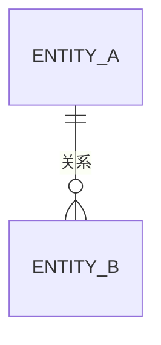

<!-- 数据设计模板。逻辑模型与领域概念对应；领域关系不应仅凭 ER 图推断。 -->

# 数据设计

> 状态：草稿
> 关联：DOM-*、CMP-*

## 逻辑数据模型

<!-- 概念结构与 DOM-* 的对应关系；关系型结构可用 erDiagram -->

## 标识与约束

<!-- 主键、业务键、重要唯一约束 -->

## 引用完整性与删除策略

## 状态、版本与审计字段

<!-- 状态字段与状态模型的一致性；时间与变更原因的语义 -->

## 索引与规模假设

## 事务边界与并发控制

## 迁移、归档与保留
