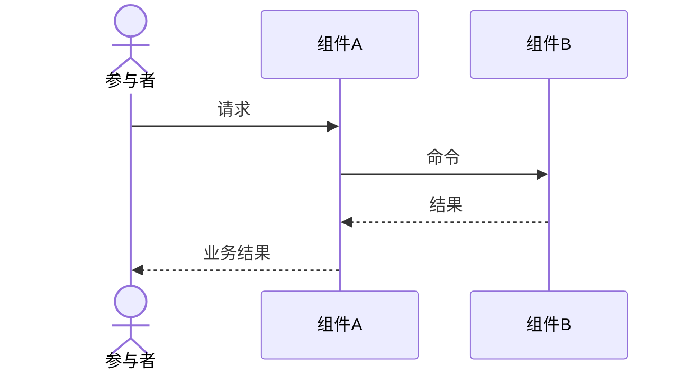

<!-- 交互设计模板。复制本文件后按 seq-编号-短名.md 重命名；只为高风险路径创建。 -->

# SEQ-001 交互名称

> 状态：草稿
> 关联：UC-001、CMP-001、INT-001

## 场景与前置条件

## 正常流程

<!-- 按需使用 alt、opt、loop 和注释表达关键分支；普通参数和内部函数调用不必全部展示 -->

## 失败与恢复

<!-- 超时、拒绝、返回未知结果等分支的处理 -->

## 一致性和幂等

## 可观测性
